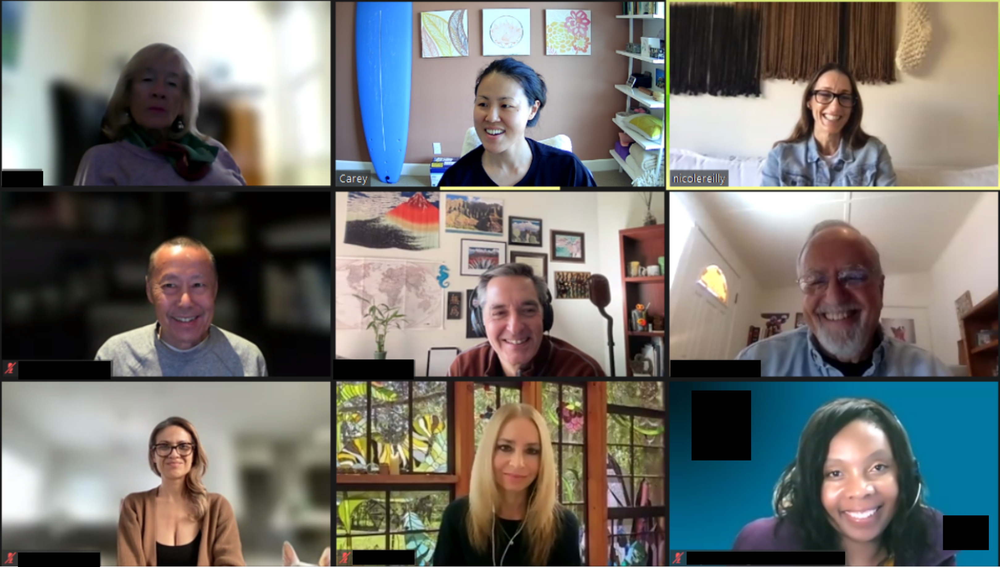

```{r setup, include=FALSE}
knitr::opts_chunk$set(echo = FALSE)
knitr::opts_chunk$set(warning = FALSE)
knitr::opts_chunk$set(message = FALSE)

library(tidyverse)
library(readxl)
library(lubridate)
library(viridis)
library(googlesheets4)
library(wordcloud)
library(RColorBrewer)
library(tm)

google_url <- "https://docs.google.com/spreadsheets/d/1RLOJXi2VQBOabrcT1qiLiyNO1k7eW8wm7E1Fze1NlRM/edit?usp=sharing"
```

### Background

* Susan Samueli Integrative Health Institute has graciously offered UCI and the greater community daily opportunities to practice mindfulness for roughly two years

* A consistent mindfulness practice has improved mental and physical well-being of community members and have transformed lives (please see **Testimonials** section below)

* As a data scientist, I have been curious about how the mindfulness community has evolved over time 
 
* To gather data for this passion project, I have been monitoring attendance at SSIHI mindfulness community classes since April of 2021

* The data only contain aggregated summary statistics and anonymity of individual participants is strictly protected

* Using the data I have collected, I wanted to take the opportunity to show how the community has stayed consistent in number throughout the length of the program

* Moreover, individual engagement during community meditation has always been relatively high despite the format being virtual meetings through Zoom

* Data indicate that the mindfulness community is evolving; the percentage of male participants has been steadily increasing

* The small class size encourages active participation by community members

* Finally, community members shared their thoughts on how the weekday mindfulness practice has positively impacted their lives

```{r import_data}
df <- read_sheet(google_url) %>%
  mutate(Time_Start_24hr = substr(Time_Start_24hr, 12, 16),
         Date_Monday = floor_date(Date, "weeks", week_start = 1),
         Sharing_Participants = as.numeric(Sharing_Participants, na.omit = TRUE),
         Day_Of_Week = as.factor(Day_Of_Week)) %>%
  select(Number, Date, Date_Monday, Day_Of_Week, everything())
df$Day_Of_Week = fct_relevel(df$Day_Of_Week, levels = c("Monday", "Tuesday", "Wednesday", "Thursday", "Friday", "Sunday"))

free_meditation <- df %>%
  filter((Practice_Type == "Meditation") & (Cost == "Free"))

yoga <- df %>%
  filter(Practice_Type == "Yoga")

paid_meditation <- df %>%
  filter((Practice_Type == "Meditation") & (Cost != "Free"))

other <- df %>%
  filter(!(Practice_Type %in% c("Meditation","Yoga")))
```


### Individuals participate actively during community meditations

```{r meditation_attend}
free_meditation %>%
  group_by(Date_Monday) %>%
  summarise(attend = as.integer(mean(Participants_Include_Instructor))) %>%
  # plot attendance
  ggplot(aes(x = as.Date(Date_Monday), y = attend)) +
  geom_col(aes(fill = as.factor(quarter(Date_Monday))), color = "black") +
  scale_fill_viridis(discrete = TRUE, direction = -1) +
  scale_x_date(date_breaks = "3 months", date_labels = "%Y-%b") +
  scale_y_continuous(limits = c(0, 17)) +
  labs(
    title = "Attendance at community meditation has been consistent over time",
    tag = "Figure 1",
    x = "Date (Year-Month)",
    y = "Number of participants per class",
    caption = "Each bar represents a weekly average based on classes attended by the author.",
    fill = "Quarter") +
  theme_gray()
```

* Figure 1 shows that the number of participants at community meditation classes has been consistent over time

* The spike in attendance during the summer of 2021 (2021-Q3) is most likely due to the pilot employee well-being program that temporarily allowed participation from employees of other UC campuses

```{r meditation_camera}
free_meditation %>%
  mutate(On = Camera_On_Participants / Participants_Include_Instructor * 100) %>%
  mutate(Year_Quarter = paste(year(Date), quarter(Date), sep = "-Q")) %>%
  group_by(Year_Quarter) %>%
  summarise(Meditation = mean(On)) -> df_temp
yoga %>%
  mutate(On = Camera_On_Participants / Participants_Include_Instructor * 100) %>%
  mutate(Year_Quarter = paste(year(Date), quarter(Date), sep = "-Q")) %>%
  group_by(Year_Quarter) %>%
  summarise(Yoga = mean(On)) -> df_temp1
df_temp %>%
  left_join(df_temp1) -> df_temp2
df_temp2 %>%
  pivot_longer(cols = c(Meditation, Yoga)) -> df_temp3
df_temp3 %>%
  # plot camera_on, camera_off
  ggplot(aes(x = Year_Quarter, y = value)) +
  geom_col(aes(fill = name), color = "black") +
  facet_wrap(~ name) +
  scale_fill_viridis(discrete = TRUE, direction = -1) +
  scale_x_discrete(guide = guide_axis(angle = 45)) +
  theme(strip.background = element_blank(), strip.text = element_blank()) +
  labs(
    title = "Percentage meditation with camera on remains high",
    tag = "Figure 2",
    x = "Date (Year-Quarter)",
    y = "Percent of participants with camera on",
    caption = "Each bar represents a quarterly average based on classes attended by the author.",
    fill = "Practice") +
  theme_gray()
```

* Whether a participant has their camera on during a virtual meditation class may indicate greater engagement, comfort and willingness to share 

```{r camera_on_percent}
free_meditation %>%
  mutate(On = Camera_On_Participants / Participants_Include_Instructor * 100) -> df_temp
value1 <- as.integer(mean(df_temp$On), NA.omit = TRUE) 
yoga %>%
  mutate(On = Camera_On_Participants / Participants_Include_Instructor * 100) -> df_temp1
value2 <- as.integer(mean(df_temp1$On), NA.omit = TRUE)
```


* Figure 2 shows that the percentage of participation with camera on has remained relatively stable across time

* On average, `r value1`% of participants turn their camera on during community meditation classes

* This is much higher than the average percentage of participation with camera on at community yoga for well-being classes, which is at `r value2`% 


```{r meditation_class_size}
free_meditation %>%
  filter(Participants_Include_Instructor >= 5) %>%
  mutate(Class_Size = Participants_Include_Instructor,
         Camera = Camera_On_Participants / Participants_Include_Instructor * 100,
         Share = Sharing_Participants / Participants_Include_Instructor * 100,
         Chat = Participants_Asking_Questions_Afterwards_Commenting_In_Chat / Participants_Include_Instructor * 100) %>%
  pivot_longer(cols = c('Camera', 'Share', 'Chat')) %>%
  # plot class_size vs. measures of engagement
  ggplot(aes(x = Class_Size, y = value)) +
  geom_jitter(aes(color = name), alpha = 0.8) +
  geom_smooth(aes(color = name), method = "lm") +
  scale_y_log10() +
  scale_x_log10() +
  scale_color_viridis(discrete = TRUE) +
  labs(
    title = "Smaller class sizes are correlated with greater individual engagement",
    tag = "Figure 3",
    x = "Class size",
    y = "Percentage of participants",
    caption = "Each jittered dot represents one class. \n 
    Curve fits are based on linear models after log transformation.",
    color = "Type of engagement") +
  theme_gray()
```

* Figure 3 shows that smaller class sizes are correlated with higher percentages of participants taking part in some form of community engagement

* The three forms of community engagement considered are: turning the camera on ("Camera"), commenting in the chat window and/or asking questions after class ("Chat"), and sharing their experience about the meditation practice ("Share")

* This indicates that smaller group settings may encourage more active engagement by participants

* Smaller classes may lead to a higher quality of meditation practice and greater community engagement


### Attendance is influenced by factors such as participant's gender and day of the week

```{r meditation_gender}
free_meditation %>%
  mutate(female = Female_Participants / Participants_Include_Instructor * 100,
         male = Male_Participants / Participants_Include_Instructor * 100,
         unknown = 100 - female - male) %>%
  mutate(Year_Quarter = paste(year(Date), quarter(Date), sep = "-Q")) %>%
  group_by(Year_Quarter) %>%
  summarise(Female = mean(female),
            Male = mean(male),
            Unknown = 100 - Female - Male, 
            Male_SEM = sd(male) / sqrt(n())) %>%
  pivot_longer(cols = c(Female, Male, Unknown)) %>%
  mutate(name = as.factor(name)) -> df_temp

df_temp$name <- fct_relevel(df_temp$name, levels = c("Unknown", "Female", "Male")) 

df_temp %>%
  filter(name == 'Male') -> df_temp1
  
df_temp %>%
  # plot gender
  ggplot(aes(x = Year_Quarter, y = value)) +
  geom_col(aes(fill = name), color = "black") +
  geom_errorbar(data = df_temp1, width = 0.5, 
                aes(x = Year_Quarter, ymin = value - Male_SEM, ymax = value + Male_SEM)) +
  scale_fill_viridis(discrete = TRUE) +
  labs(
    title = "Male participation at community meditation has steadily increased",
    tag = "Figure 4",
    x = "Date (Year-Quarter)",
    y = "Percentage of participants",
    caption = "Each bar represents a quarterly average based on classes attended by the author. \n 
    Error bars represent mean ± standard error.",
    fill = "Gender") +
  theme_gray()
```

* It is a well-known trend that community meditation classes attract more women than men

```{r meditation_male_percent}
df_temp %>%
  filter((Year_Quarter %in% c('2021-Q2', '2022-Q4')) & (name == 'Male')) %>%
  pull(value) %>%
  as.integer() -> values
```

* Figure 4 suggests that the percentage of male participants has been steadily increasing over time

* The average percentage of male participants increased from `r values[1]`% to `r values[2]`% in 1.5 years

```{r meditation_day_of_week}
free_meditation %>%
  # plot day of the week attendance
  ggplot(aes(x = Day_Of_Week, y = Participants_Include_Instructor)) +
  geom_boxplot(outlier.shape = NA, show.legend = FALSE) +
  geom_jitter(aes(color = Day_Of_Week), width = 0.1, alpha = 0.8) +
  scale_color_viridis(discrete = TRUE) +
  labs(
    title = "Attendance at community meditation is highest at the start of the week",
    tag = "Figure 5",
    x = "",
    y = "Number of participants per class",
    caption = "Each jittered dot represents one class. Center line in boxplots represents the median.",
    color = "Day of week") +
  theme_gray()
```

* Figure 5 indicates that community meditation attendance is highest on Mondays and lowest on Wednesdays

* Days of the week with the highest attendance numbers are Mondays, Tuesdays and Fridays

* Note that meditation classes take place at noon on Mondays, Wednesdays, Fridays; and at 5pm on Tuesdays and Thursdays


### Topics discussed during community meditation

```{r meditation_by_instructors}
free_meditation %>%
  filter(Instructor %in% c("\"Amy Noelle\"", "\"Nicole Reilly\"", "\"Cayce Howe\"")) -> med_3_instructors
med_3_instructors %>%
  filter(Instructor == c("\"Amy Noelle\"")) -> Amy
med_3_instructors %>%
  filter(Instructor == c("\"Nicole Reilly\"")) -> Nicole
med_3_instructors %>%
  filter(Instructor == c("\"Cayce Howe\"")) -> Cayce
```

```{r amy_wordcloud, eval = FALSE}
# Amy
# create vector containing only text
text <- Amy$Topic
# create a corpus
docs <- Corpus(VectorSource(text))
# clean up text
docs %>%
  tm_map(removeNumbers) %>%
  tm_map(removePunctuation) %>%
  tm_map(stripWhitespace) -> docs
docs <- tm_map(docs, content_transformer(tolower))
docs <- tm_map(docs, removeWords, stopwords("english"))
# create a document-term-matrix
dtm <- TermDocumentMatrix(docs)
matrix <- as.matrix(dtm)
words <- sort(rowSums(matrix), decreasing=TRUE) 
df_freq <- data.frame(word = names(words), freq = words)
# generate the word cloud
set.seed(1234)
wordcloud(words = df_freq$word, 
          freq = df_freq$freq,
          min.freq = 1, 
          max.words = nrow(df_freq),
          random.order = FALSE, 
          rot.per = 0, 
          colors = brewer.pal(3, "Dark2"),
          scale = c(3,.3))
```

```{r nicole_wordcloud, eval = FALSE}
# Nicole
# create vector containing only text
text <- Nicole$Topic
# create a corpus
docs <- Corpus(VectorSource(text))
# clean up text
docs %>%
  tm_map(removeNumbers) %>%
  tm_map(removePunctuation) %>%
  tm_map(stripWhitespace) -> docs
docs <- tm_map(docs, content_transformer(tolower))
docs <- tm_map(docs, removeWords, stopwords("english"))
# create a document-term-matrix
dtm <- TermDocumentMatrix(docs)
matrix <- as.matrix(dtm)
words <- sort(rowSums(matrix), decreasing=TRUE) 
df_freq <- data.frame(word = names(words), freq = words)
# generate the word cloud
wordcloud(words = df_freq$word, 
          freq = df_freq$freq,
          min.freq = 1, 
          max.words = nrow(df_freq),
          random.order = FALSE, 
          rot.per = 0, 
          colors = brewer.pal(3, "Dark2"),
          scale = c(3,.3))
```

```{r cayce_wordcloud, eval = FALSE}
# Cayce
# create vector containing only text
text <- Cayce$Topic
# create a corpus
docs <- Corpus(VectorSource(text))
# clean up text
docs %>%
  tm_map(removeNumbers) %>%
  tm_map(removePunctuation) %>%
  tm_map(stripWhitespace) -> docs
docs <- tm_map(docs, content_transformer(tolower))
docs <- tm_map(docs, removeWords, stopwords("english"))
# create a document-term-matrix
dtm <- TermDocumentMatrix(docs)
matrix <- as.matrix(dtm)
words <- sort(rowSums(matrix), decreasing=TRUE) 
df_freq <- data.frame(word = names(words), freq = words)
# generate the word cloud
wordcloud(words = df_freq$word, 
          freq = df_freq$freq,
          min.freq = 1, 
          max.words = nrow(df_freq),
          random.order = FALSE, 
          rot.per = 0, 
          colors = brewer.pal(3, "Dark2"),
          scale = c(3,.3))
```

```{r all_wordcloud, eval = FALSE}
# Amy
# create vector containing only text
text <- med_3_instructors$Topic
# create a corpus
docs <- Corpus(VectorSource(text))
# clean up text
docs %>%
  tm_map(removeNumbers) %>%
  tm_map(removePunctuation) %>%
  tm_map(stripWhitespace) -> docs
docs <- tm_map(docs, content_transformer(tolower))
docs <- tm_map(docs, removeWords, stopwords("english"))
# create a document-term-matrix
dtm <- TermDocumentMatrix(docs)
matrix <- as.matrix(dtm)
words <- sort(rowSums(matrix), decreasing=TRUE) 
df_freq <- data.frame(word = names(words), freq = words)
# generate the word cloud
set.seed(1234)
wordcloud(words = df_freq$word, 
          freq = df_freq$freq,
          min.freq = 1, 
          max.words = nrow(df_freq),
          random.order = FALSE, 
          rot.per = 0, 
          colors = brewer.pal(8, "Dark2"),
          scale = c(3,.3))
```


* The word cloud illustration shows words in daily topics discussed by each instructor during mindfulness meditations

* The most commonly mentioned words appear in a larger font

* Some topics are frequently discussed by all instructors, such as meditation, body scan, breath/breathing, awareness, and kindness

* There are also many distinct topics discussed by each instructor, illustrating uniqueness of their teachings


* Considering all three instructors' classes together, the mindfulness community benefits from a wide range of topics covered by the weekday meditation classes


### Testimonials


#### From the Author

My name is Carey Huh and I worked as a neuroscientist at UCI between 2017 and 2022. My mindfulness journey began with a free virtual Mindfulness Based Stress Reduction course offered by SSIHI in May 2020, at the start of the COVID-19 pandemic. Since then, I have been a regular practitioner at SSIHI's weekday community meditations and yoga for well-being classes. The pandemic years have been a difficult, and deeply isolating, time for many of us. The community practice, albeit virtual, has provided a much needed opportunity to pause, check in, be in the present, in a shared experience with others. They certainly have been a lifesaver for my mental and physical well-being! In April 2021, I participated in the 8-week Mindful Self-Compassion course offered by SSIHI, taught by Amy Noelle. A consistent mindfulness practice and self-compassion teachings have helped to completely transform my life. I changed my career and became a data scientist working in the public health sector. Since my new job solely involves computer work, it has allowed me to work from home, which has enabled me to stay connected with the UCI mindfulness community that I have grown to cherish. Every day, I look forward to the guided practice, led by talented and engaging instructors, and seeing my fellow meditators as we sit, learn and share together. I work for the LA County Department of Public Health and they have started to offer Wednesday virtual meditation sits. I attended a few sessions but I found myself returning to this group as I find the meditation guidance at UCI SSIHI to be of a much higher quality. Last year around this time, a core group of around 8 of us got together and shared in the efforts to send a holiday gift to each of our meditation instructors. It is my hope that this report will serve to show how critical the mindfulness practice has been to so many of us and how the practice will continue to have sustained positive impacts on the lives of current and future members as the community evolves and grows even stronger.


#### Mindful Meditator 1

The mindful meditation classes have enriched my life. I look forward to the meditations to calm my mind and nervous system. An added bonus, I also look forward to the wonderful community we have grown over the past couple of years. The instructors are top notch! Each brings a uniqueness and I always learn something new. 


#### Mindful Meditator 2

When I first learned that there was an opportunity for UCI staff to participate in a meditation class I was hesitant, but curious. I had never done meditation and I wasn’t really planning on doing it more than once. I felt at the time that I just didn’t have the time in my schedule to dedicate every Monday, Wednesday and Friday at noon to attend the class. But, at the time, I also knew that I needed help. My mental health during the onset of the pandemic was not very good, but it was difficult and expensive to find and work with a therapist. I knew I needed to do something, but I just didn’t know what to do. I’m the primary caretaker for both of my parents (both in their late 80’s and my dad had just been diagnosed with dementia). With a heavy workload (all hands on deck was the theme at the time!) and with my parent’s deteriorating health, all became overwhelming. I wasn’t sleeping and the constant feelings of anxiousness and stress was relentless and exhausting.


I can honestly say these meditation classes saved my life. Meditation has helped me transform my mindset from one of stress and fear and uncertainty, to one that tends to welcome abundance, acceptance, gratitude and positivity. Not every day is easy, but my resilience is so much stronger because I know how to bring myself back into the moment and learned some of the tools and techniques to release tension and stress. The changes didn’t happen all at once, but was very gradual. Our meditation guides (Amy, Nicole and Cayce) lead us through the practice of mindful breathing. And, it didn’t take long before I started to see results. I was able to manage the stress easier, cope with the pandemic and the various other challenges at the time and reduced my anxiety and depression. I was impressed and so kept attending.


They call these classes “practices”, which I thought was a little weird at first. But, now I realize that it really is a practice to learn how to be mindful throughout the day. Like anything in life, it takes a lot of practice to get good at something. The pandemic is slowly going away, but I’ve realized that the benefits of mindfulness meditation is continuing to provide benefits with not just my life, but also within my work at UCI. The lessons and learning from our “practices” is ongoing and I feel there’s still so much more to learn.  For the benefit of all UCI employees (especially the ones that haven’t started these classes yet) are among the best benefits an employee can have. I’m proud to work at UCI and an institution that prioritizes the mental health of its employees. Of all the employee benefits that I receive at UCI, meditation continues to have the most impact in bettering my life at home and work.  Please consider continuing these opportunities so others my also gain the many benefits of a meditation practice.  


#### Mindful Meditator 3

I am on my second year of a MSc in Neuroscience, and the current class/module is on the Mindfulness of Neuroscience and Application. I have been practicing on and off for years, but didn't know about this community and feel so blessed to have found it. Especially at this moment as I learn more about mindfulness' effects on the brain and mental health. I really hope there is a way to move forward with the free sessions.


#### Mindful Meditator 4

The mindfulness classes have taught me how important it is to take time each day to cultivate peace and equanimity. Through an ongoing practice, I know how to calm my mind and access a deeper place of kindness, wisdom and intuition. When my mind is calm, it helps me handle the daily stressors in life without getting hijacked by my emotions or the swirling thoughts in my head. When I am calm it is easier for the people around me to stay calm. Additionally, I so enjoy the community of like minded spirits. Their presence makes a difference in my life.


#### Mindful Meditator 5

Meditation has become my life thanks to all the passionate, mindful instructors. It is a real jewel to be able to have our zoom meetings every day, they have become imperative for my well-being. Please continue these ever so meaningful meetings for the future.


#### Mindful Meditator 6

Since summer 2020, SSIHI’s Mindfulness classes via zoom have helped me cope with the topsy-turvy of late. Learning the ancient practice of mindfulness with Amy, Nicole, and Cayce helps me be purposely self-aware and focused on the now. Through my SSIHI teachers, I’ve learned to be gentle and accepting of myself and others. Now in December 2022, the weekly zoom sessions continue to be The Key to reducing my stress and increasing my well-being. I have deep gratitude to SSIHI for generously helping me learn how to “breath”.  


#### Roberto Moreno

Dear Ms Drew de Paz,


Having recently been notified that the Meditation and Mindfulness Class offered by UCI will no longer be offered, I am left with a definite sense of loss, as much so for myself as for the group. This is a core group of some 8 to 10 folks who have pretty much bonded over the last two years. More recently, new members are showing up and returning, while others seem to come and go. The group continues to evolve and given the exceptional guidance and training we receive, the experience continues to be enlightening and transformative.


I started the class just one year after losing my wife and in the midst of learning how to live without her. Now, two years later, I look back on what I’ve learned as a result of the systematic training and practice I was so fortunate to have received. Collectively, I have come to understand and experience:


The frequent moments of quiet solitude and peaceful stillness; The ability to embrace and relish a given moment; Acquiring an acute awareness of my breathing, often times using it as an “anchor” from which to remain focused and grounded; Having the ability to focus on any one of my 5 sensory organs and listen to the information they continuously offer; Knowing I have choices available to me in response to the information I receive from my body; Sustaining meditation practice when life is going well, knowing it will help when it isn’t; Wrestling with the courage and challenge of accepting and embracing whatever life has in store for me; Having the ability to observe the ebb and flow of my ceaseless wandering thoughts, their tendency to ruminate and attach, and their propensity for critical judgement of self and others; Recognizing moments of fruitless frustration and finding the humor in their counterproductive nature; Fascinated with the manner in which thoughts effect emotion, and how emotions in turn effect bodily responses, all working in tandem; The frequent sense of spirituality encountered while meditating that leaves me afloat on a cloud; Recognizing that meditating with a group is more engaging and meaningful than doing so alone; Seeking a state of mindfulness and finding solace in situations that illicit annoyance, like being stuck in traffic; Finding myself living in a continuous state of gratitude; Struggling to find the words that adequately describe the essence of my being in any given moment; and, yes, remaining challenged with the ongoing change and uncertainty of life.  Strange, in spite of my advanced stage in life, I’m coming to like myself more, sleep better, think more clearly, am more attentive to self and others, and generally feel more welcoming and alive. That’s pretty wild!


Ms Drew de Paz, how fortunate we are to be offered the opportunity to learn how to listen to our bodies, to be aware of how our minds work, and to arrive at an understanding of the interconnectivity of mind, body, and emotion, while not losing sight of our human spirituality. This has to be the kind of outcome the Health Institute in general and your department in particular hopes to actualize. As such, I remain hopeful the Meditation and Mindfulness Class can somehow be continued. If not for the existing 5 days a week, perhaps we can meet for three. Do let us know if there is anything we can do to support this effort.


### Concluding remarks

* A mindfulness practice, such as the weekday community meditation classes, provides UCI and the greater community an opportunity to develop critical skills to become more mindful, resilient, and compassionate to ourselves and others

* Community members have been actively engaging during virtual meditation classes, by turning their cameras on, writing comments in the chat window, asking questions, and sharing their experiences with others

* Small classes encourage more participants to interact with others during and after meditation practice

* There has been a steady increase in the percentage of male participants, indicating a warm, inclusive and welcoming atmosphere of the community


#### Acknowledgement

I would like to thank my fellow mindful meditators for sharing their stories. I am thankful for our talented instructors, Amy, Nicole and Cayce, for their heartful work in guiding us, and for Elsie Yi (Masters in Public Health student at UCI) for her help in the final push to bring this long-standing passion project of mine to fruition. Finally, I'm grateful to UCI and the Susan Samueli Integrative Health Institute for providing the community with classes that have such a profound, long-lasting and widespread positive impact on our lives.


#### Wednesday class pic with Nicole



#### Friday class pic with Cayce

